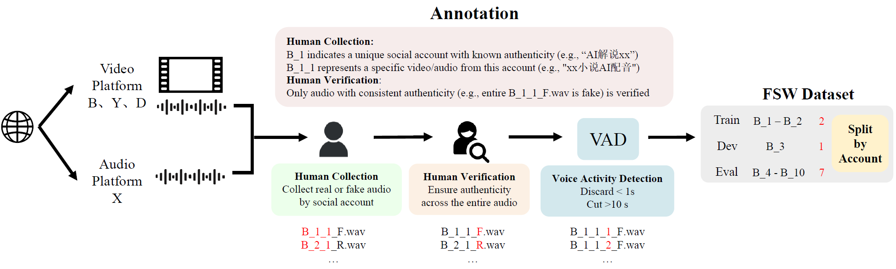

# 📁 Fake Speech Wild: Detecting Deepfake Speech on Social Media Platform

  

## 📌 Description

This is the dataset repo of our work titled “Fake Speech Wild: Detecting Deepfake Speech on Social Media Platform”, which was available on arxiv at "https://arxiv.org/".

This repository describes a dataset of audio samples collected from publicly accessible online media sources. The data was originally crawled for research purposes and includes unaltered/raw audio files to reduce the burden of manual downloading.

⚠️ **Although original audio files are provided, usage is strictly controlled.** Access is granted solely for academic research under the conditions outlined below.

---

## 🔒 Access Policy (Application Required)

To protect the rights of original content owners and ensure responsible usage, **this dataset is not publicly downloadable**.

Researchers must request access by completing the form linked below:

👉 **[Google Drive Access Request Form](https://your-google-drive-link-here)**

Applicants must provide:
- Full name  
- Institutional affiliation (university/lab/organization)  
- Academic/professional email  
- Intended use of the dataset  
- Agreement to the terms described in the LICENSE file in this repository

Once approved, a private Google Drive link to the dataset will be shared.

---

## 📜 Terms of Use

By requesting, accessing, or downloading this dataset, you **agree unconditionally** to the following:

1. **Academic Research Only**  
   This dataset may only be used for **non-commercial academic research** purposes.

2. **Personal Use Only**  
   The dataset is for **individual use by the approved applicant only**.  
   **Redistribution, sharing, re-uploading, or repackaging** of the data (in part or whole) is strictly prohibited.

3. **No Commercial Use**  
   You may **not** use this dataset for:
   - Commercial training of models  
   - Product development  
   - Paid services  
   - Any other profit-driven activity

4. **Attribution Required**  
   Any public work (e.g. papers, presentations) that uses this dataset must:
   - Clearly cite the dataset  
   - Include a link to this repository

5. **Legal Liability**  
   Misuse (e.g., redistribution or commercial use) may result in:
   - Legal action  
   - Public disclosure of misuse  
   - Revocation of access rights

---

## ⚠️ Disclaimer

This dataset includes audio collected from publicly available online media. All copyrights belong to their original content owners.

We do **not** claim ownership of the original media. This dataset is distributed strictly under **academic fair use principles**. If you are a copyright holder and would like your content removed, please contact us.

---

## 📌 Citation

If you use this dataset, please cite:

